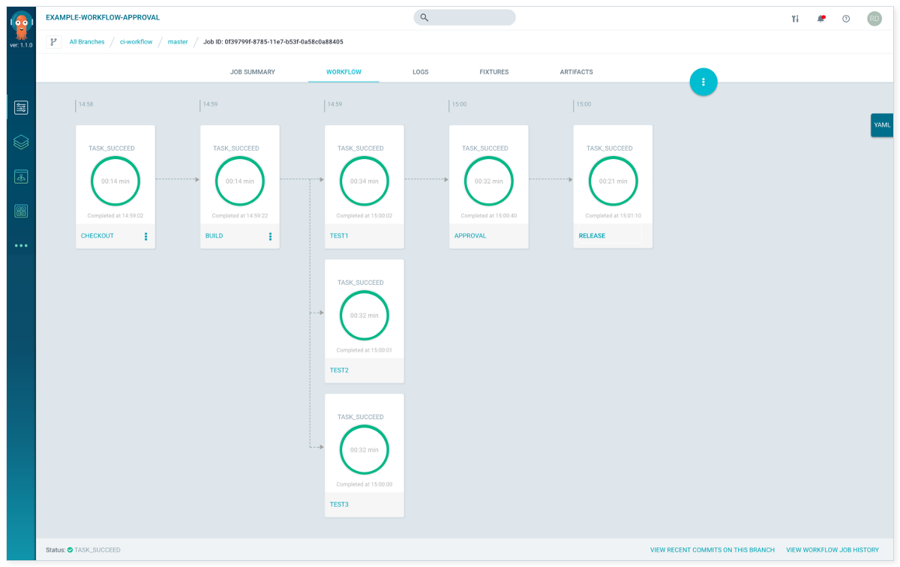
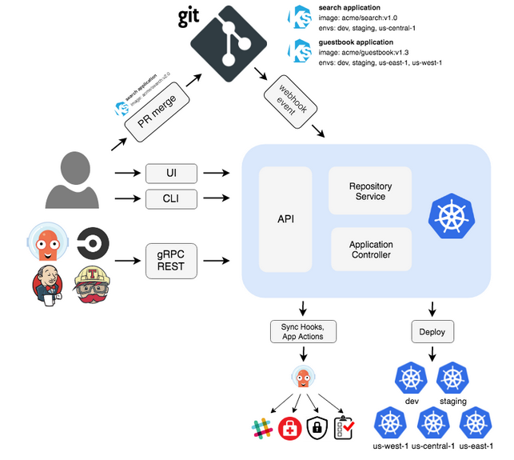
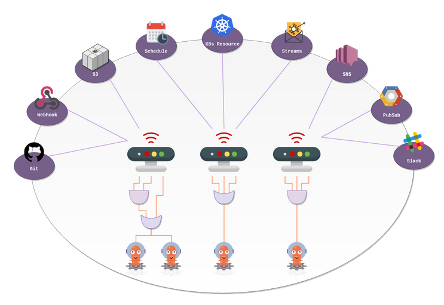

# Argo
---

# Introduction

---

## What Is It?
* An open source container-native workflow engine for Kubernetes
* By Applatix team
* Facilitates
    - specifying
    - scheduling
    - and coordinating
    - the running workflows and apps on Kubernetes

---

## Components:
* Argo Workflows: Container-native Workflow Engine
* Argo CD: Declarative GitOps Continuous Delivery
* Argo Events: Event-based Dependency Manager

---

## How?
* By
    - combining a workflow engine
    - with native artifact management
    - admission control
    - `fixtures`
    - built-in support for DinD (Docker-in-Docker)
    - and policies

---

## Use Cases

* Traditional CI/CD pipelines
* Complex jobs with both sequential and parallel steps and dependencies
* Orchestrating deployments of complex, distributed applications
* Policies to enable time/event-based execution of workflows

---

## Why Argo?
* Provides:
    - simple and flexible mechanisms
    - for specifying constraints 
    - between the steps
        - in a workflow 
        - and artifact management
    - for linking the output of any step as an input
    - to subsequent steps

---

## LAB: Installing Argo
* Overview:
We will be installing Argo version 2.2.1 as a stand-alone server
* Build on previous lab: None
* Run time: 30 mins
* Address: Argo_Installation.md

---


## Containers vs VMs
* Unlike VMs, containers provide:
    - lightwaight
    - and reliable
    - packaging of the execution environment and application
    - into a portable self-contained image
* Workflows
    - can be defined and managed as code (YAML)
    - are portable and version controlled
---

## A Sample Argo Workflow



---


## LAB: Argo Workflow Templates by Example
* Overview:
We will be learning most useful commands and creating a very simple workflow template
* Build on previous lab: Argo_Installation.md
* Run time: 30 mins
* Address: Argo_Wrokflow_Templates.md

---

# Argo CD

---

## What is Argo CD?
* Argo CD is a
    - declarative
    - GitOps continuous delivery tool
    - for Kubernetes
---

## Why Argo CD?
* To make declarative and version controlled:
    - Application definitions
    - configurations
    - and environment
* Application deployment and lifecycle management sould be:
    - automated
    - uditable
    - and easy to understand

---

## Architecture


---

## Getting Started
A simple start would be like this:

```bash
kubectl create namespace argocd
kubectl apply -n argocd -f https://raw.githubusercontent.com/argoproj/argo-cd/stable/manifests/install.yaml
```
# Argo Events

---

## What Is Argo Events?
* An event-based dependency manager
* For Kubernetes
* Helps to define multiple dependencies
* From a variety of events sources like 
    - webhook
    - s3
    - schedules
    - streams
* Triggers objects after successful event dependencies reslution
---

## Argo Events in an image



---

## Core Concepts
* **Gateway** is implemented
    - as a Kubernetes-native Custom Resource Definition processes events from event source.
* **Sensor** is implemented as a Kubernetes-native Custom Resource Definition defines a set of event dependencies and triggers K8s resources.

---

## LAB: Argo events
* Overview:
We will be installing requirements and running event-based activities
* Builds on previous lab: Argo_Installation.md
* Run time: 40 mins
* Address: Argo_Events.md

---